# Hi there 👋

### I'm Norton_Lin
- 🏫 A master's student at Beijing University of Posts and Telecommunications.
- 🌱 Majoring in Moving Target Defense and Zero Trust Architecture
- 💻 Skilled in backend development
- 🤖 Currently interested in the field of intelligent agents
- 📫 How to reach me: [norton@bupt.edu.cn](mailto:norton@bupt.edu.cn)

- Welcome to communicate with me

### Some Stats





<!--START_SECTION:waka-->


**🐱 My GitHub Data** 

> 📦 211.6 kB Used in GitHub's Storage 
 > 
> 🏆 8 Contributions in the Year 2026
 > 
> 🚫 Not Opted to Hire
 > 
> 📜 23 Public Repositories 
 > 
> 🔑 12 Private Repositories 
 > 
**I'm an Early 🐤** 

```text
🌞 Morning                502 commits         █████░░░░░░░░░░░░░░░░░░░░   20.95 % 
🌆 Daytime                1045 commits        ███████████░░░░░░░░░░░░░░   43.61 % 
🌃 Evening                762 commits         ████████░░░░░░░░░░░░░░░░░   31.80 % 
🌙 Night                  87 commits          █░░░░░░░░░░░░░░░░░░░░░░░░   03.63 % 
```
📅 **I'm Most Productive on Tuesday** 

```text
Monday                   336 commits         ████░░░░░░░░░░░░░░░░░░░░░   14.02 % 
Tuesday                  489 commits         █████░░░░░░░░░░░░░░░░░░░░   20.41 % 
Wednesday                342 commits         ████░░░░░░░░░░░░░░░░░░░░░   14.27 % 
Thursday                 359 commits         ████░░░░░░░░░░░░░░░░░░░░░   14.98 % 
Friday                   273 commits         ███░░░░░░░░░░░░░░░░░░░░░░   11.39 % 
Saturday                 238 commits         ██░░░░░░░░░░░░░░░░░░░░░░░   09.93 % 
Sunday                   359 commits         ████░░░░░░░░░░░░░░░░░░░░░   14.98 % 
```


📊 **This Week I Spent My Time On** 

```text
🕑︎ Time Zone: Asia/Shanghai

💬 Programming Languages: 
No Activity Tracked This Week

🔥 Editors: 
No Activity Tracked This Week

🐱‍💻 Projects: 
No Activity Tracked This Week

💻 Operating System: 
No Activity Tracked This Week
```

**I Mostly Code in Python** 

```text
Python                   6 repos             ██████░░░░░░░░░░░░░░░░░░░   25.00 % 
Go                       4 repos             ████░░░░░░░░░░░░░░░░░░░░░   16.67 % 
Kotlin                   1 repo              █░░░░░░░░░░░░░░░░░░░░░░░░   04.17 % 
HTML                     1 repo              █░░░░░░░░░░░░░░░░░░░░░░░░   04.17 % 
JavaScript               1 repo              █░░░░░░░░░░░░░░░░░░░░░░░░   04.17 % 
```


**Timeline**


 Last Updated on 25/04/2026 19:27:14 UTC
<!--END_SECTION:waka-->
