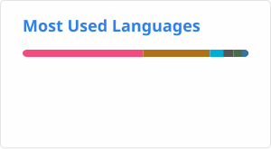

# Hi there 👋

### I'm Norton_Lin
- 🏫 A master's student at Beijing University of Posts and Telecommunications.
- 🌱 Majoring in Moving Target Defense and Zero Trust Architecture
- 💻 Skilled in backend development
- 🤖 Currently interested in the field of intelligent agents
- 📫 How to reach me: [norton@bupt.edu.cn](mailto:norton@bupt.edu.cn)

- Welcome to communicate with me

### Some Stats





<!--START_SECTION:waka-->


**🐱 My GitHub Data** 

> 📦 211.8 kB Used in GitHub's Storage 
 > 
> 🏆 8 Contributions in the Year 2026
 > 
> 🚫 Not Opted to Hire
 > 
> 📜 23 Public Repositories 
 > 
> 🔑 12 Private Repositories 
 > 
**I'm an Early 🐤** 

```text
🌞 Morning                514 commits         ████░░░░░░░░░░░░░░░░░░░░░   17.80 % 
🌆 Daytime                1249 commits        ███████████░░░░░░░░░░░░░░   43.25 % 
🌃 Evening                954 commits         ████████░░░░░░░░░░░░░░░░░   33.03 % 
🌙 Night                  171 commits         █░░░░░░░░░░░░░░░░░░░░░░░░   05.92 % 
```
📅 **I'm Most Productive on Tuesday** 

```text
Monday                   348 commits         ███░░░░░░░░░░░░░░░░░░░░░░   12.05 % 
Tuesday                  537 commits         █████░░░░░░░░░░░░░░░░░░░░   18.59 % 
Wednesday                450 commits         ████░░░░░░░░░░░░░░░░░░░░░   15.58 % 
Thursday                 503 commits         ████░░░░░░░░░░░░░░░░░░░░░   17.42 % 
Friday                   345 commits         ███░░░░░░░░░░░░░░░░░░░░░░   11.95 % 
Saturday                 286 commits         ██░░░░░░░░░░░░░░░░░░░░░░░   09.90 % 
Sunday                   419 commits         ████░░░░░░░░░░░░░░░░░░░░░   14.51 % 
```


📊 **This Week I Spent My Time On** 

```text
🕑︎ Time Zone: Asia/Shanghai

💬 Programming Languages: 
No Activity Tracked This Week

🔥 Editors: 
No Activity Tracked This Week

🐱‍💻 Projects: 
No Activity Tracked This Week

💻 Operating System: 
No Activity Tracked This Week
```

🤖 **AI Coding This Week** 

```text
No AI Coding Activity Tracked This Week
```

**I Mostly Code in Python** 

```text
Python                   6 repos             ██████░░░░░░░░░░░░░░░░░░░   25.00 % 
Go                       4 repos             ████░░░░░░░░░░░░░░░░░░░░░   16.67 % 
Kotlin                   1 repo              █░░░░░░░░░░░░░░░░░░░░░░░░   04.17 % 
HTML                     1 repo              █░░░░░░░░░░░░░░░░░░░░░░░░   04.17 % 
JavaScript               1 repo              █░░░░░░░░░░░░░░░░░░░░░░░░   04.17 % 
```


**Timeline**


 Last Updated on 31/08/2026 23:00:33 UTC
<!--END_SECTION:waka-->
