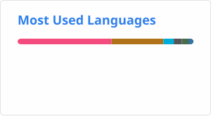

# Hi there 👋

### I'm Norton_Lin
- 🏫 A master's student at Beijing University of Posts and Telecommunications.
- 🌱 Majoring in Moving Target Defense and Zero Trust Architecture
- 💻 Skilled in backend development
- 🤖 Currently interested in the field of intelligent agents
- 📫 How to reach me: [norton@bupt.edu.cn](mailto:norton@bupt.edu.cn)

- Welcome to communicate with me

### Some Stats





<!--START_SECTION:waka-->


**🐱 My GitHub Data** 

> 📦 211.9 kB Used in GitHub's Storage 
 > 
> 🏆 11 Contributions in the Year 2026
 > 
> 🚫 Not Opted to Hire
 > 
> 📜 23 Public Repositories 
 > 
> 🔑 13 Private Repositories 
 > 
**I'm an Early 🐤** 

```text
🌞 Morning                514 commits         ████░░░░░░░░░░░░░░░░░░░░░   17.75 % 
🌆 Daytime                1255 commits        ███████████░░░░░░░░░░░░░░   43.34 % 
🌃 Evening                956 commits         ████████░░░░░░░░░░░░░░░░░   33.01 % 
🌙 Night                  171 commits         █░░░░░░░░░░░░░░░░░░░░░░░░   05.90 % 
```
📅 **I'm Most Productive on Tuesday** 

```text
Monday                   354 commits         ███░░░░░░░░░░░░░░░░░░░░░░   12.22 % 
Tuesday                  537 commits         █████░░░░░░░░░░░░░░░░░░░░   18.54 % 
Wednesday                450 commits         ████░░░░░░░░░░░░░░░░░░░░░   15.54 % 
Thursday                 503 commits         ████░░░░░░░░░░░░░░░░░░░░░   17.37 % 
Friday                   347 commits         ███░░░░░░░░░░░░░░░░░░░░░░   11.98 % 
Saturday                 286 commits         ██░░░░░░░░░░░░░░░░░░░░░░░   09.88 % 
Sunday                   419 commits         ████░░░░░░░░░░░░░░░░░░░░░   14.47 % 
```


📊 **This Week I Spent My Time On** 

```text
🕑︎ Time Zone: Asia/Shanghai

💬 Programming Languages: 
Python                   1 hr 16 mins        ██████████████████░░░░░░░   71.43 % 
Markdown                 23 mins             ██████░░░░░░░░░░░░░░░░░░░   22.17 % 
Git Config               6 mins              ██░░░░░░░░░░░░░░░░░░░░░░░   06.40 % 

🔥 Editors: 
Codex Vscode             1 hr 46 mins        █████████████████████████   98.85 % 
VS Code                  1 min               ░░░░░░░░░░░░░░░░░░░░░░░░░   01.15 % 

🐱‍💻 Projects: 
zta-base-dual-pep        1 hr 47 mins        █████████████████████████   100.00 % 

💻 Operating System: 
Windows                  1 hr 47 mins        █████████████████████████   100.00 % 
```

🤖 **AI Coding This Week** 

```text
⏱ AI Coding Time: 1 hr 47 mins (100.0%)

✍️ 707 lines written by AI, 0 lines written by hand (100.0% AI-written)

🔤 506,329 Input Tokens, 40,334 Output Tokens

💵 $19.03 Estimated AI Cost This Week

🧠 1 AI Sessions, 7 AI Prompts

GPT                      707 lines           █████████████████████████   100.00 % 

🔎 AI Coding Insights:
🤖 AI-Driven — 100.0% of written lines came from AI
📝 Concise Prompter — average 56 characters per prompt
🔁 Iterative Prompter — average 7 prompts per session
🚀 High AI Trust — 0.0% of changed lines were hand-edited
```

**I Mostly Code in Python** 

```text
Python                   6 repos             ██████░░░░░░░░░░░░░░░░░░░   24.00 % 
Go                       5 repos             █████░░░░░░░░░░░░░░░░░░░░   20.00 % 
Kotlin                   1 repo              █░░░░░░░░░░░░░░░░░░░░░░░░   04.00 % 
HTML                     1 repo              █░░░░░░░░░░░░░░░░░░░░░░░░   04.00 % 
JavaScript               1 repo              █░░░░░░░░░░░░░░░░░░░░░░░░   04.00 % 
```


**Timeline**


 Last Updated on 09/10/2026 22:50:08 UTC
<!--END_SECTION:waka-->
